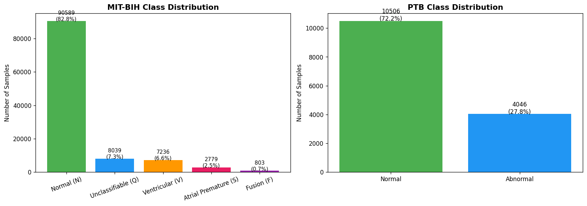
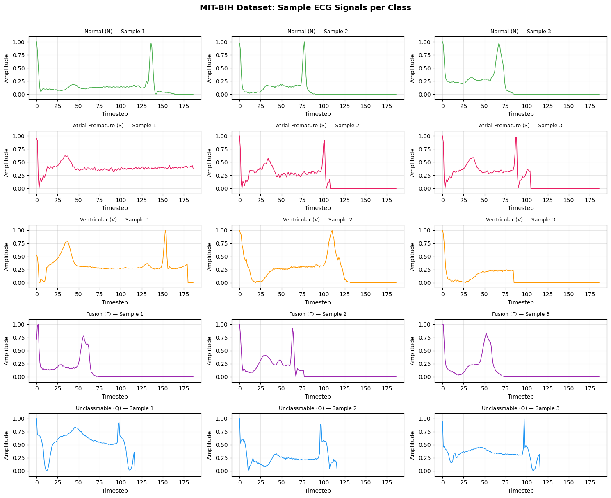
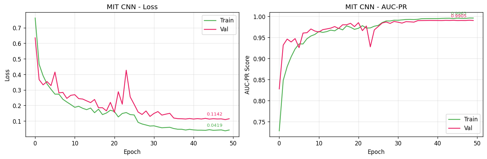
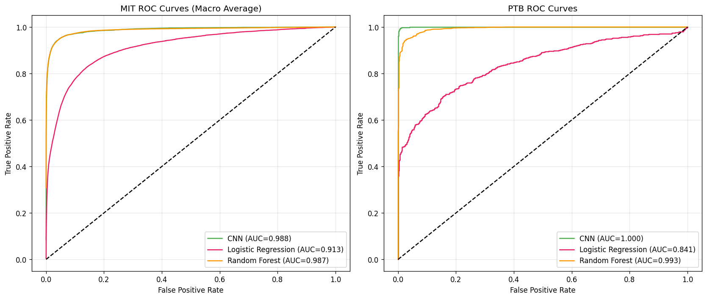
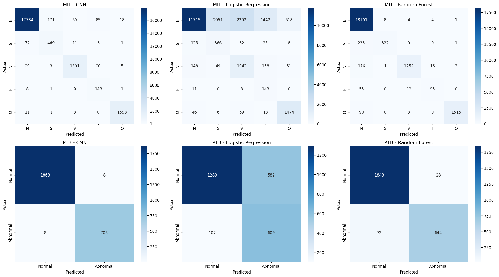

# ECG Heartbeat Classification — 1D CNN

A deep learning project classifying ECG heartbeats across two PhysioNet datasets using a 1D Convolutional Neural Network built in TensorFlow/Keras. Benchmarked against Logistic Regression and Random Forest baselines.

---

## Datasets

| Dataset | Task | Samples | Classes |
|---|---|---|---|
| MIT-BIH Arrhythmia Database | 5-class classification | 109,446 beats | Normal, Supraventricular, Ventricular, Fusion, Unclassifiable |
| PTB Diagnostic ECG Database | Binary classification | 14,552 records | Normal vs Abnormal |

Both datasets were preprocessed by Kachuee et al. (2018): segmented, resampled to 125Hz, and padded to 187 timesteps.

---

## Class Distribution

Both datasets are heavily imbalanced — MIT-BIH is 82.8% Normal, PTB is 72.2% Normal. AUC-PR was used as the primary evaluation metric rather than accuracy.

### ECG Signal Samples by Class (MIT-BIH)

Three samples per class show the waveform patterns the CNN learns to distinguish. Normal beats are consistent; Atrial Premature (S) beats show high variability; Fusion (F) beats combine characteristics of Normal and Ventricular, making them the hardest class to separate.

---

## Model Architecture

A three-block 1D CNN processes the 187-timestep signal directly, without manual feature engineering:

- **Block 1–3:** Conv1D → Batch Normalisation → MaxPooling1D
- **Regularisation:** L2 on all Conv/Dense layers, SpatialDropout1D
- **Head:** Dense layers with Dropout → Softmax (MIT-BIH) / Sigmoid (PTB)
- **Training:** EarlyStopping, ReduceLROnPlateau, class weights for imbalance

Best hyperparameters (manual grid search): `dropout=0.3`, `lr=0.001`, `batch_size=64`

---

## Split Strategy

**MIT-BIH:** Kaggle-provided train/test split preserved. Stratified 15% validation carved from training data.

**PTB:** No patient IDs available, so a naive random split risks patient-level leakage. MiniBatchKMeans (290 clusters, matching known patient count) was used as a patient proxy, with GroupShuffleSplit separating clusters across train/val/test. The seed producing the smallest class balance gap (0.3%) was selected, yielding a 68.6/13.6/17.8 split.

---

## Training Curves (MIT-BIH CNN)

Validation loss stabilised to 0.1142 with AUC-PR peaking at 0.9905. Learning rate reductions at epochs 27 and 36 drove further improvement.

---

## Hyperparameter Tuning

Five configurations were tested across dropout rate, learning rate, and batch size. AUC-PR on both datasets was used as the combined selection criterion. The best configuration (dropout=0.3, lr=0.001, batch_size=64) was used to retrain the final models.

---

## Results

### ROC Curves

The 1D CNN matched or outperformed both baselines on MIT-BIH (AUC 0.988 vs Random Forest 0.987) and achieved near-perfect separation on PTB (AUC 1.000).

### Confusion Matrices

The CNN substantially improved minority-class recall on MIT-BIH compared to Logistic Regression, particularly for Fusion (F: 0.88) and Atrial Premature (S: 0.84). PTB classification was near-perfect with only 16 misclassifications across 2,587 test records.

### Summary

| Model | MIT-BIH Macro F1 | MIT-BIH AUC-PR | PTB Macro F1 | PTB AUC-PR |
|---|---|---|---|---|
| **1D CNN** | **0.8801** | **0.9439** | **0.9923** | **0.9995** |
| Random Forest | 0.8572 | 0.9225 | 0.9508 | 0.9818 |
| Logistic Regression | 0.4778 | 0.5919 | 0.7139 | 0.5540 |

*AUC-PR is the primary metric given class imbalance.*

---

## Key Methodological Decisions

- **AUC-PR over accuracy** — accuracy is misleading on imbalanced data; AUC-PR penalises false positives on minority classes
- **Cluster-based split for PTB** — prevents patient-level data leakage where no explicit patient IDs exist
- **Label correction** — PTB CSV files had inverted labels; corrected before training
- **Class weights** — applied during training to penalise minority-class misclassification

---

## Stack

`Python` `TensorFlow` `Keras` `Scikit-learn` `Pandas` `NumPy` `Matplotlib` `Seaborn`

---

## Reference

Kachuee et al. (2018) — *ECG Heartbeat Classification: A Deep Transferable Representation*. IEEE ICHI. [arXiv:1805.00794](https://doi.org/10.48550/arXiv.1805.00794)
